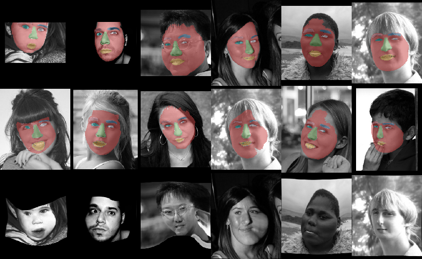

# Semantically-guided Large Deforamtion Estimation with Deep Netowrks 

**Code**

Example code for "Semantically-Guided Large Deformation Estimationwith Deep Networks"

(Tested with Pytorch version 1.3.1, cudnn version 7.6.03)

  
**Datasets**

Datasets used in the experiments:

- *Face Dataset* resized Helen dataset [1] can be found under: http://pages.cs.wisc.edu/~lizhang/projects/face-parsing/ 

- *Medical Dataset* Automated Cardiac Diagnosis Challenge (ACDC) dataset [2] can be found under:  https://www.creatis.insa-lyon.fr/Challenge/acdc/databases.html 

  
*[1] Brandon M. Smith, Li Zhang, Jonathan Brandt, Zhe Lin, Jianchao Yang. Exemplar-Based Face Parsing, IEEE Computer Society Conference on Computer Vision and Pattern Recognition (CVPR), June, 2013.*

*[2] O. Bernard, A. Lalande, C. Zotti, F. Cervenansky, et al. "Deep Learning Techniques for Automatic MRI Cardiac Multi-structures Segmentation and Diagnosis: Is the Problem Solved ?" in IEEE Transactions on Medical Imaging, vol. 37, no. 11, pp. 2514-2525, Nov. 2018 doi: 10.1109/TMI.2018.2837502*

**Training dataset for demo** can be downloaded <a href="https://cloud.imi.uni-luebeck.de/s/tTkssFjpzdZT9ek">here</a>.

  
  
**Results**

**Examples** 

Example results of our approach. (Top) reference image with the ground truth reference labels, (middle) target image with warped ground truth reference labels, (bottom) warped reference images.
  

